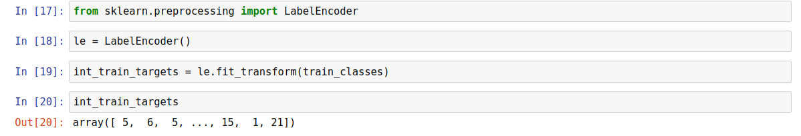
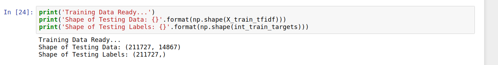
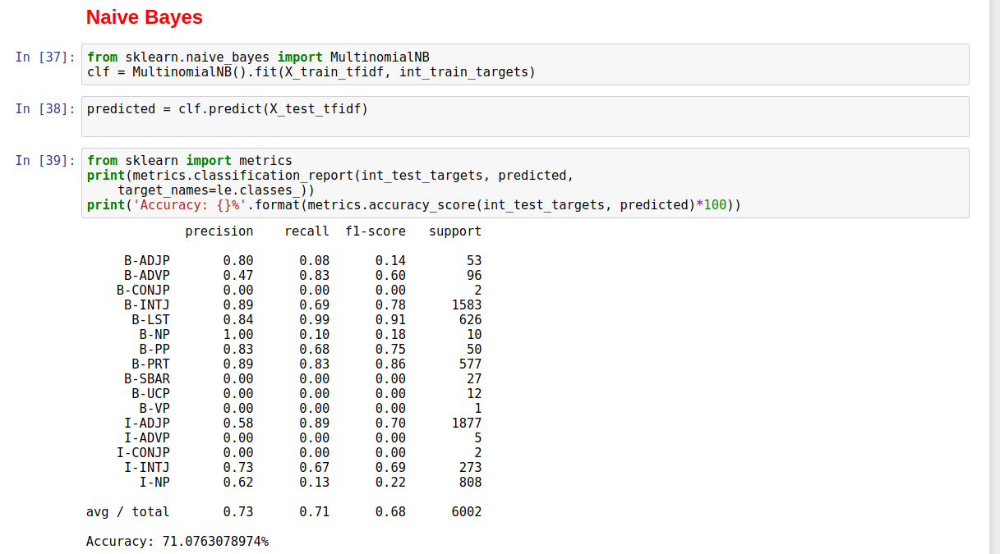
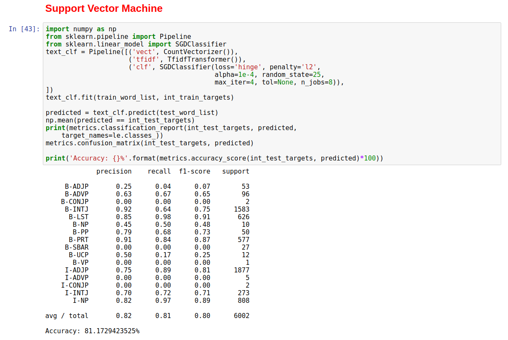
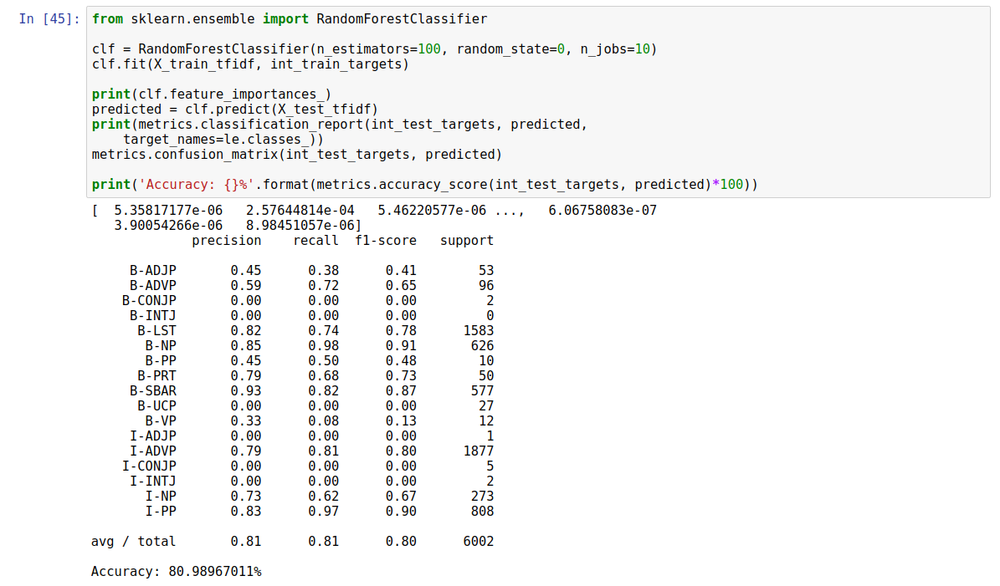

## Assignment 2
## CMPT 825 Natural Language Processing
* Student Name: Anmol Sharma
* Student ID: asa224
* Student Email ID: anmol_sharma@sfu.ca

## Modelling Non-Recursive Chunking Problem as a Supervised Learning Problem suitable for Machine Learning

The following text summarizes the experiments that I performed as I tackled the problem as a supervised learning one, and discusses the results that were obtained from those implementations. For easy viewing of the code along with its output, an HTML version of the iPython Notebook is added to this directory by the name `ML_Chunking.html`.

*__DISCLAIMER:__* The ideas for framing the problem statement were inspired by number of readings, many from my previous experience in machine learning, and some from my current literature review. However the code/implementation is entirely my own.

## Problem Statements

The non-recursive text chunking problem can be seen as a supervised learning problem where the given training set `(x, y)` consists of `x = word POS_tag` and `y = CHUNK_TAG`. Most NLP tasks would take the context of the word itself into account, however for the sake of simplicity in this experiment only the current word and its POS_tag are used as input features to predict the word's CHUNK_TAG.

The given training dataset is divided into two sets, `features` and `targets`, which are:

~~~~
Features          | Targets
--------------------------------
Rockwell NNP      | B-NP
International NNP | I-NP
Corp. NNP         | I-NP
's POS            | B-NP
Tulsa NNP         | I-NP
unit NN           | I-NP
...
...
...
~~~~

**Now I provide an overview of the various data preprocessing steps that were performed in order bring the dataset close to what I could for training a neural network model.**

### Initial Integer Embedding

A machine learning model cannot directly work on categorical data, the issue arises that the data must converted to an integral representation to make it compatible for training. We generate a matrix of token counts using `scikit-learn`'s built in function `CountVectorizer`.

Also, the targets themselves have to be encoded into integer form, for which i use simple dictionary lookup, where each new target value is assigned a unique integer value. For this task, `scikit-learn`'s `LabelEncoder` is used.

## Training Data

After the preprocessing is done, the training set is generated with shapes as follows:

## Training ML Models
### Naive Bayes

### Support Vector Machine

### Random Forest

## Discussion and Conclusion

Support Vector Machine using hinge loss and `l2` weight regularization performs the best in the experiments, which was close to 81% accuracy and 80% f1-score. The score is lower than the baseline model due to the main reason that none of the ML model developed here uses the context of the word, and doesn't take into account the `history` element of usual NLP pipeline. Hence there is room for improvement if we utilize words that appear before and after the current word, as well as the CHUNK_TAGs of words predicted before.
